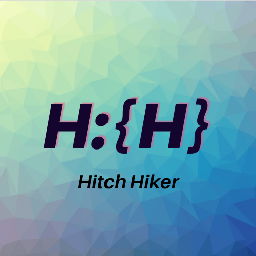

<h1> 🙋🏻HITCH HIKER 🛤️ project 여행 매칭 서비스</h1>

 

   
  
   
  
  
   

## Link 
- <h3>Hitch Hiker 배포 링크 : https://www.hitch-hiker.kr</h3>
- <h3>Hitch Hiker Wiki  : https://github.com/codestates-seb/seb39_main_006/wiki</h3>

 

 

## 기술 스택

 

## 팀원 소개

| 김기홍 | 배자현 |  정윤조   |  이동기   |
| :--------: | :---------: | :------: | :-----: |
| BE 엔지니어 | FE 엔지니어 |  BE 엔지니어  |  FE 엔지니어 팀장 |
| 안물어요 | 주의 | 안물어요 | 안물어요 |
|   ![김기홍]    |    ![배자현]    | ![정윤조] | ![이동기] |

 

## 서비스 시연 장면

***토글을 눌러 기능별 시연을 확인할 수 있습니다***

### 회원가입

회원가입 시, 닉네임 중복 검사와 이메일 인증을 진행합니다.

    
### 로그인

로그인은 일반 이메일 로그인과 카카오 소셜 로그인을 지원합니다.

- 

- 

### 게시글 작성        

게시글을 작성할 수 있습니다. 이미지 첨부를 지원합니다.

    
### 게시글 수정

게시글을 수정 및 삭제할 수 있습니다.

### 게시글 북마크

선호하는 게시물을 북마크할 수 있습니다.

### 게시글 검색 및 정렬

게시글을 날짜 및 내용으로 검색하고 다양한 기준으로 정렬할 수 있습니다.

### 매칭 신청

참여하고 싶은 여행에 매칭 신청을 보냅니다. 이 때, 게시글 작성자에게 알림이 갑니다.

### 매칭 수락 혹은 거절

게시글의 주인은 매칭 신청을 수락 혹은 거절할 수 있습니다. 이 때, 매칭 신청자에게 알림이 갑니다.

### 참여 취소

참여자를 추방 혹은 참여자가 직접 참여를 취소할 수 있습니다. 이 때, 해당 참여자에게 알림이 갑니다.

### 내 정보 확인

MYPAGE에서 게시글과 매칭 현황 등 내 정보를 확인할 수 있습니다.

### 내 정보 수정

MYPAGE에서 내 정보를 수정할 수 있습니다.

<!-- Stack Icon Refernces -->

[js]:https://github.com/bizbaeja/bizbaeja/blob/main/svg/js.svg
[react]:https://github.com/bizbaeja/bizbaeja/blob/main/svg/react.svg
[node]:https://github.com/bizbaeja/bizbaeja/blob/main/svg/node.svg
[sb]:https://github.com/bizbaeja/bizbaeja/blob/main/svg/sb.svg
[김기홍]:https://img1.daumcdn.net/thumb/R1280x0/?scode=mtistory2&fname=https%3A%2F%2Fblog.kakaocdn.net%2Fdn%2FtAfOa%2FbtrMBsXyhfs%2FmZV2bPDxRg7TlCizRjqEIk%2Fimg.png
[배자현]:https://img1.daumcdn.net/thumb/R1280x0/?scode=mtistory2&fname=https%3A%2F%2Fblog.kakaocdn.net%2Fdn%2FbWMC7M%2FbtrMC8K56Uv%2FCJRKClqmlDJJPlC3A5oxG0%2Fimg.png
[정윤조]:
https://img1.daumcdn.net/thumb/R1280x0/?scode=mtistory2&fname=https%3A%2F%2Fblog.kakaocdn.net%2Fdn%2FcWs5Xi%2FbtrMy0ghBkI%2FLFLoGNT5GwKMjhETyGoYdK%2Fimg.png
[이동기]:https://img1.daumcdn.net/thumb/R1280x0/?scode=mtistory2&fname=https%3A%2F%2Fblog.kakaocdn.net%2Fdn%2FtBn64%2FbtrMDy3AFli%2FBhdzGm8PkNkqPBp8tBIDKk%2Fimg.png
